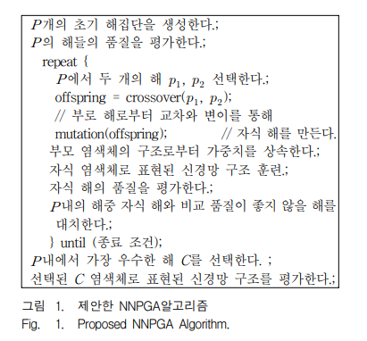

# 신경망의 노드 가지치기를 위한 유전 알고리즘 (Genetic Algorithm for Node Pruning of Neural Networks)

## 메타데이터
- **제목**: 신경망의 노드 가지치기를 위한 유전 알고리즘
- **영문 제목**: Genetic Algorithm for Node Pruning of Neural Networks
- **저자**: 허기수* (Gi-Su Heo), 오일석** (Il-Seok Oh)
- **소속**: 
  - *전북대학교 컴퓨터정보학과 (Department of Computer and Information Science, Chonbuk National University)
  - **전북대학교 전자정보공학부 컴퓨터공학 (Department of Computer Engineering, Chonbuk National University)
- **발행**: 전자공학회 논문지 제46권 CI편 제2호, 65-74페이지, 2009년 3월
- **논문번호**: 2009-46CI-2-9
- **접수일자**: 2008년 9월 5일
- **수정완료일**: 2009년 2월 26일
- **키워드**: 신경망 최적화, 유전알고리즘, 데이터정규화, 노드 가지치기 (Neural Networks Node Optimization, Genetic Algorithm, Data Normalization, Node Pruning)
- **연구지원**: 교육과학기술부와 한국산업기술재단의 지역혁신인력양성사업
- **원문 링크**: https://www.dbpia.co.kr/pdf/pdfView.do?nodeId=NODE01161308

## Abstract (초록)

신경망의 구조를 최적화하기 위해서는 노드 또는 연결을 잘라내는 가지치기 방법과 노드를 추가해 나가는 구조 증가 방법이 있다. 이 논문은 신경망의 구조 최적화를 위해 가지치기 방법을 사용하며, 최적의 노드 가지치기를 찾기 위해 유전 알고리즘을 사용한다. 기존 연구에서는 입력층과 은닉층의 노드를 따로 최적화 대상으로 삼았다. 우리는 두 층의 노드를 하나의 염색체에 표현하여 동시 최적화를 꾀하였다. 자식은 부모의 가중치를 상속받는다. 학습을 위해서는 기존의 오류 역전파 알고리즘을 사용한다. 실험은 UCI Machine Learning Repository에서 제공한 다양한 데이터를 사용하였다. 실험 결과 신경망 노드 가지치기 비율이 평균 8∼25%에서 좋은 성능을 얻을 수 있었다. 또한 다른 가지치기 및 구조 증가 알고리즘과의 교차검증에 대한 t-검정 결과 그들에 비해 우수한 성능을 보였다.

**English Abstract**: In optimizing the neural network structure, there are two methods of the pruning scheme and the constructive scheme. In this paper we use the pruning scheme to optimize neural network structure, and the genetic algorithm to find out its optimum node pruning. In the conventional researches, the input and hidden layers were optimized separately. On the contrary we attempted to optimize the two layers simultaneously by encoding two layers in a chromosome. The offspring networks inherit the weights from the parent. For learning, we used the existing error back-propagation algorithm. In our experiment with various databases from UCI Machine Learning Repository, we could get the optimal performance when the network size was reduced by about 8∼25%. As a result of t-test the proposed method was shown better performance, compared with other pruning and construction methods through the cross-validation.

## 1. 서론 (Introduction)

최근까지 신경망은 분류기를 사용하는 다양한 응용에서 우수한 성능을 제공하고 있다. 신경망의 성능은 신경망 구조(입력 및 은닉 노드의 수)와 다양한 변수(가중치 초기 값, 훈련 계수, 모멘텀 등)에 의해 좌우된다[1].

최적화된 구조와 가중치를 갖는 신경망은 일반화(generalization) 성능이 뛰어나다. 일반화 성능이 뛰어난 신경망 구조는 일반적으로 경험에 의해 또는 여러 번의 실험에 의해 결정된다. 하지만 이 방법은 많은 시간과 노력을 요구한다. 이런 단점을 극복하기 위해 작은 네트워크 구조에서 출발하여 점점 크기를 증가시켜가는 구조 증가(constructive) 알고리즘과 필요한 것보다 큰 네트워크 구조에서 시작하여 점점 크기를 줄여가는 연결소거 또는 노드 가지치기(pruning) 알고리즘이 사용되고 있다[2].

본 논문은 신경망의 노드 가지치기를 위한 유전 알고리즘을 제안한다. 신경망의 입력층과 은닉층은 서로 신호를 주고받는 직접적인 관계를 갖는다. 따라서 상호 밀접한 연관 관계를 가질 수밖에 없다. 하지만 기존의 방법들은 입력층과 은닉층의 노드를 따로 취급하여 최적화를 시도하였다[3∼6]. 본 논문에서는 입력층과 은닉층의 노드를 하나의 염색체로 표현하여 동시 최적화를 시도하였다.

입력층에 대한 가지치기는 특징 선택 문제이며, 은닉층에 대한 가지치기는 최적의 은닉 노드 개수를 결정하는 문제와 동일하다. 이 두 가지 문제를 동시에 해결하여 높은 성능의 신경망 구조를 찾는 것과 동시에 유전 알고리즘의 교차와 돌연변이 연산과정에서 생성되는 신경망 가중치는 부모의 가중치를 그대로 상속받는다. Yao는 여러 가지 문헌의 관찰을 통해 신경망 구조와 가중치를 동시에 최적화해야 가장 좋은 성능을 보인다고 하였다[2].

본 논문의 구성은 다음과 같다:
- II장: 기존의 신경망 최적화방법과 유전 알고리즘을 이용한 최적화 방법
- III장: NNPGA(Neural networks Node Pruning with Genetic Algorithm) 알고리즘의 구조와 신경망의 염색체 표현, 진화 연산
- IV장: 실험 데이터 특징 설명 및 실험 결과 분석
- V장: 결론

## 2. 관련 연구 (Related Work)

### 2.1 신경망 최적화

신경망 최적화란 일반화 능력이 뛰어난 구조와 가중치를 가진 신경망을 찾는 작업이다. 일반화 성능은 학습 데이터가 고정되어 있을 경우 신경망의 구조에 가장 큰 영향을 받는 것으로 알려져 있다[2]. 하지만 불행하게도 적합한 네트워크의 구조를 사전에 알 수가 없다.

일반화 성능이 좋은 신경망을 찾기 위해, 보통 신경망의 구조를 여러 가지로 변경하며 성능 실험을 하여 그중 가장 좋은 것을 답으로 취하는 휴리스틱한 방법을 사용한다. 하지만 이 방법은 많은 시간과 노력이 필요하며, 작은 네트워크의 경우 초기 가중치 값에 민감하여 학습이 제대로 이루어 지지 않는 단점이 있다[7].

이런 문제를 해결하기 위해 구조 증가(constructive) 알고리즘과 연결 소거 또는 가지치기(pruning) 알고리즘이 있다[8]. 구조증가 알고리즘은 작은 네트워크 구조에서 시작하여 점점 크기를 증가 시켜가는 반면, 가지치기 알고리즘은 문제에 필요한 것보다 큰 네트워크 구조에서 시작하여 점점 크기를 줄여가며 최적화된 구조를 찾는다.

신경망 가지치기 방법에는 다음과 같은 것들이 있다[9]:

1. **민감도 방법(sensitivity method)**: 가중치의 중요도 기준을 정의한 후 훈련 과정에서 민감도가 가장 적은 가중치를 삭제
   - 가중치 크기 기반 연결 소거
   - 최적 두뇌 손실(Optimal Brain Damage)[10]
   - 최적 두뇌 의사(Optimal Brain Surgeon)[11]
   - 영향력 계수(Impact Factor) 연결 소거법[7]

2. **정규화 방법(regularization method) 또는 페널티 방법(penalty terms)**: 기존의 오차 함수에 벌칙 항을 더한 새로운 오차 함수를 정의[12∼13]

3. **유전 알고리즘의 진화연산을 이용하는 방법**: 가중치 및 노드를 염색체로 표현하고 교차 및 변이 연산 과정을 통하여 부모 세대보다 좋은 성능을 가진 자식세대로 진화

민감도 방법이나 페널티 방법은 적절한 매개변수 조절과 정규화 매개 변수의 결정에 성능이 좌우되며, 전역적 최적 점을 찾지 못하고 지역적 최적 점에 쉽게 빠질 가능성이 있는 단점이 있다.

### 2.2 유전 알고리즘을 이용한 최적화

유전 알고리즘을 이용한 신경망 최적화는 가중치, 구조, 가중치와 구조 최적화로 분류할 수 있다[2].

1. **가중치 최적화**: 미리 정의된 신경망 구조에 대해 가장 좋은 성능을 가진 가중치를 찾는 것. 다층 퍼셉트론 신경망을 훈련시키는 대표적인 오류 역전파(error back-propagation) 알고리즘은 미분강하법(gradient descent)을 이용한다. 미분강하법은 지역 최적 점에 빠질 수 있으며 큰 규모의 신경망일 경우 학습시간이 오래 걸리는 단점이 있다. 이런 단점을 극복하기 위하여 전역 최적 점을 찾을 가능성이 높은 유전 알고리즘을 이용하는 방법이 연구되고 있다[14∼15].

2. **구조 최적화**: 유전 알고리즘을 이용하여 신경망의 구조(즉, 은닉 층 개수와 노드의 개수)와 연결 형태 등을 선택하는 작업. Miller 등은 소규모 회로망의 최적화에 유전 알고리즘을 제시하였다[15]. Arena는 최적 노드의 수를 결정하는 유전 알고리즘을 제안하였으며[16], 고정된 수의 노드를 최적으로 배치하는 연구도 발표하였다[17].

3. **가중치 및 구조 최적화**: 앞의 두 방법을 결합한 형태로 신경망의 가중치와 구조를 동시에 최적화한다. Pujol의 실험은 가중치와 구조를 동시에 최적화할 때 좋은 성능을 보여 주었다[18].

신경망과 유전 알고리즘의 결합에 있어 가장 중요한 문제는 신경망의 구조를 어떻게 염색체로 표현하는가 하는 문제이다. 가장 대표적인 방법으로 직접표현(direct encoding)과 간접 표현(indirect encoding) 방법이 있다[19].

**직접 표현 방법**은 신경망 노드 및 가중치를 이진스트링 또는 실수를 갖는 염색체로 표현한다. 직접 표현 방식에는 연결 기반 인코딩, 실수 인코딩, 노드 기반 인코딩, 층 기반 인코딩 등 다양한 방법이 있다[20]. 이 방식은 신경망 구조를 쉽게 표현할 수 있는 장점을 가지고 있다. 하지만 신경망 구조가 복잡해지고 커질수록 염색체 길이가 길어져 연산 시간이 오래 걸리는 단점을 가지고 있다.

**간접 표현 방법**은 신경망 노드 및 가중치를 직접 표현하지 않고 그 값이 만들어지는 규칙을 정의하고 염색체로 표현한다. 가장 대표적인 방법으로 Kitano의 문법 인코딩(grammar encoding)[21]방법과 Gruau의 셀룰러 인코딩(cellular encoding)[22]방법이 있다. 간접 표현 방법은 신경망 구조가 복잡하더라도 염색체 길이를 짧게 표현할 수 있는 장점이 있는 반면, 연산과정에서 염색체 유전자를 인코딩 및 디코딩해야 하는 단점이 있다.

## 3. 신경망 최적화를 위한 유전 알고리즘 (Genetic Algorithm for Neural Network Optimization)


**그림 1.** 제안한 NNPGA 알고리즘의 전체적인 구조

```
P개의 초기 해집단을 생성한다.
P의 해들의 품질을 평가한다.
repeat {
    P에서 두 개의 해 P1, P2 선택한다.
    offspring = crossover(P1, P2);    // 부모 해로부터 교차와 변이를 통해
    mutation(offspring);              // 자식 해를 만든다.
    부모 염색체의 구조로부터 가중치를 상속한다.
    자식 염색체로 표현된 신경망 구조 훈련.
    자식 해의 품질을 평가한다.
    P내의 해중 자식 해와 비교 품질이 좋지 않을 해를 대치한다.
} until (종료 조건);
P 내에서 가장 우수한 해 C를 선택한다.
선택된 C 염색체로 표현된 신경망 구조를 평가한다.
```

### 3.1 표현 (Representation)

신경망의 입력층과 은닉층에 있는 노드의 제거 여부를 '0'과 '1'로 표현한다. 그림 2는 가지치기 된 신경망과 해당 염색체를 보여준다. 입력층의 노드 개수를 n, 은닉층의 노드 개수를 h라 할 때, 염색체는 n+h개의 비트를 갖는 비트열이다.


**그림 2.** 노드 가지치기 된 신경망의 염색체 표현
- ●: 제거되지 않은 노드
- ○: 제거된 노드
- 염색체: 1 0 1 0 | 1 0 0 1 (← 입력층 → | ← 은닉층 →)

[이어서 나머지 섹션들...]

## 5. 결론 (Conclusion)

본 논문은 신경망의 입력과 은닉층 노드 가지치기 및 가중치 상속을 동시에 하여 최적의 신경망 구조와 가중치를 찾는 유전 알고리즘을 제안하였다. 

### 5.1 주요 연구 성과

1. **동시 최적화**: 노드 가지치기를 입력과 은닉 노드 동시에 수행함으로써 기존 입력 또는 은닉 노드 별개로 가지치기 되었을 때 보다 우수한 성능의 신경망 구조를 찾을 수 있었다.

2. **가중치 상속**: 진화 과정에서 가중치 상속은 교란의 역할로써 지역 최적점을 극복하여 우수한 성능을 얻을 수 있었다.

3. **시간 효율성**: 신경망 구조와 가중치 최적화를 동시에 꾀함으로써 유전 알고리즘의 진화 및 신경망의 학습에 필요한 시간 단축 효과를 얻을 수 있었다.

### 5.2 실험 결과 요약

- **최적 가지치기 비율**: 다양한 데이터에 대해 실험한 결과 **8∼25% 정도의 가지치기에서 최적의 성능**을 보임을 알아내었다.
- **계산량 감소**: 신경망의 계산량은 에지의 개수에 비례한다. 따라서 20% 가지치기하였다면, 계산량이 대략 20% 감소됨을 뜻한다.
- **실용성**: 대용량 콘텐츠의 처리 및 모바일 환경에 적합한 인식기 개발에는 이 정도의 속도 개선은 의미가 있다.

### 5.3 향후 연구 방향

향후 연구에서는 **최적의 가지치기 비율을 자동으로 결정하는 방법**을 개발할 것이다.

## References (참고문헌)

[1] L. Fausett, "Fundamentals of Neural Networks," Prentice Hall, 1994.

[2] X. Yao, "Evolving Artificial Neural Networks," Proc. of the IEEE, Vol. 87, No. 9, pp. 1423-1447, 1999.

[3] I.-S. Oh, J.-S. Lee, and B.-R. Moon, "Hybrid Genetic Algorithms for Feature Selection," IEEE Trans. on Pattern Analysis and Machine Intelligence, Vol. 26, No. 11, pp. 1424-1437, 2004.

[4] G. Castellano and A. M. Fanelli, "An Iterative Pruning Algorithm for Feedforward Neural Networks," IEEE Trans. on Neural Networks, Vol. 8, No. 3, pp. 519-531, 1997.

[5] W. Wang, W. Lu, A. Leung, S. M. Lo, Z. Xu, and X. Wang, "Optimal Feed-forward Neural Networks Based on the Combination of Constructing and Pruning by Genetic Algorithms," Proc. of the 2002 Intl. Joint Conf. on Neural Networks, Vol. 1, pp. 636-641, 2002.

[6] Z. Guo and R. E. Uhring, "Using Genetic Algorithms to Select Inputs for Neural Networks," Intl. Workshop on Combinations of Genetic Algorithms and Neural Networks, pp. 223-234, 1992.

[7] 이하준, "임팩트 팩터 정규화 기법을 이용한 신경회로망 연결소거 알고리즘", 한국과학기술원 석사학위 논문, 2001.

[8] S. Theodoridis and K. Koutroumbas, "Pattern Recognition," Academic Press, 2006.

[9] R. Reed, "Pruning Algorithms - A Survey," IEEE Trans. on Neural Networks, Vol. 4, No. 5, pp. 740-747, 1993.

[10] Y. Cun, J. S. Denker, and S. A. Solla, "Optimal Brain Damage," Advances in Neural Information Processing Systems 2, pp. 598-605, 1990.

[11] B. Hassibi and D. G. Stork, "Second Order Derivatives for Network Pruning: Optimal Brain Surgeon," Advances in Neural Information Processing Systems 5, pp. 164-171, 1992.

[12] B. E. Segee and M. J. Carter, "Fault Tolerance of Pruning Multilayer Networks," in Proc. Intl. Joint Conf. Neural Networks, Vol. II(Seattle), pp. 447-452, 1991.

[13] E. D. Karnin, "A Simple Procedure for Pruning Back-propagation trained Neural Networks," IEEE Trans. Neural Networks, Vol. 1, No. 2, pp. 239-242, 1990.

[14] J. Branke, "Evolutionary Algorithms for Neural Network Design and Training," Proc. of the First Nordic Workshop on Genetic Algorithms and their Applications, 1995.

[15] G. Miller, P. Todd, and S. Hedge, "Designing Neural Networks using Genetic Algorithms," Proc. 3rd Intl. Joint Conf. on Genetic Algorithms, pp. 379-384, 1989.

[16] P. Arena, R. Caponetto, L. Fortuna, and M. G. Xibilia, "Genetic Algorithm to Select Optimal Neural Network Topology," Proc. 35th Midwest Symposium on Circuit and Systems, Washington, 1992.

[17] P. Arena, R. Caponetto, L. Fortuna, and M. G. Xibilia, "MLP Optimal Selection Via Genetic Algorithms," Proc. Intl. Conf. Neural Networks and Genetic Algorithms, Innsbruck, Austria, 1993.

[18] J. C. F. Pujol and R. Poli, "Evolving the Topology and the Weights of Neural Networks Using a Dual Representation," Applied Intelligence, Vol. 8, No. 1, pp. 73-84, 1998.

[19] Y. LeCun, "Generalization and Network Design Strategies," Technical Report CRG-TR-89-4, Department of Computer Science, University of Toronto, Canada, 1989.

[20] P. Koehn, "Combining Genetic Algorithms and Neural Networks: The Encoding Problem," Master's thesis, University of Tennessee, Knoxville, 1994.

[21] H. Kitano, "Designing Neural Networks Using Genetic Algorithms with Graph Generation System," Complex Systems, Vol. 4, pp. 461-467, 1990.

[22] F. Gruau, "Neural Networks Synthesis Using Cellular Encoding and The Genetic Algorithm," PhD thesis, Laboratoire de l' Informatique du Parallilisme, Ecole Normale Supirieure de Lyon, France, 1994.

[23] 문병로, "유전 알고리즘," 두양사, 2003.

[24] UCI Machine Learning Repository. [Online]. Available: http://mlearn.ics.uci.edu/MLRepository.html

[25] Neural Network FAQ, 2004 [online] Available: ftp://ftp.sas.com/pub/neural/FAQ.html, W. S. Sarles, periodic posting to the Usenet newsgroup comp.ai.neural-net, URL.

[26] P. P. Palmes, T. Hayasaka, and S. Usui, "Mutation-Based Genetic Neural Network," IEEE Trans. on Neural Networks, Vol. 16, No. 3, pp. 587-600, 2005.

[27] T. Q. Huynh and R. Setiono, "Effective Neural Network Pruning Using Cross-validation," Proc. Intl. Joint Conf. on Neural Networks, pp. 972-977, 2005.

[28] R. Quinlan, "C4.5: Programs for Machine Learning," Morgan Kanufman, San Mateo, CA, 1993.

[29] E. Frank, Y. Wang, S. Inglis, G. Holmes and I. H. Witten, "Using Model Trees for Classification," Machine Learning, Vol. 32, No. 1, pp. 63-76, 1997.

[30] R. Setiono, "Feedforward Neural Network Construction Using Cross-validation," Neural Computation, Vol. 13, No. 12, pp. 2865-2877, 2001.

## 저자소개 (Authors)

**허기수(정회원)**
- 2000년 전북대학교 기계공학부 산업공학과 학사 졸업
- 2004년 전북대학교 정보과학 컴퓨터 정보 석사 졸업
- 2004년∼전북대학교 컴퓨터정보학과 박사과정
- 주관심분야: 영상처리, 패턴인식, 컴퓨터비전

**오일석(정회원)**
- 1984년 서울대학교 컴퓨터공학과 학사 졸업
- 1992년 KAIST 전산학과 박사 졸업  
- 1992년∼전북대학교 전자정보공학부 컴퓨터공학 전공 교수
- 주관심분야: 문서영상처리, 패턴인식, 컴퓨터비전

---

**논문 변환 완료**  
*이 마크다운 문서는 학술 논문 HTML/PDF를 RAG 및 Vector DB 최적화 구조로 변환한 결과입니다.*